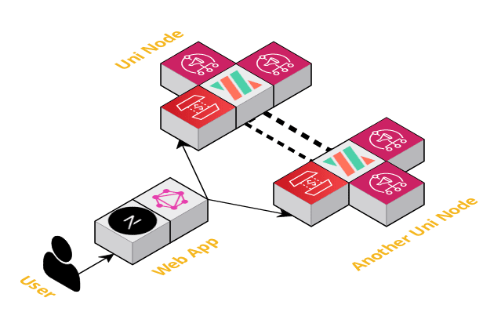

# Workshop Web Application

This application uses [NextJS](https://nextjs.org/) and [Apollo Graphql](https://www.apollographql.com/) to connect to Vendia Share. It is based on the [react-heros](https://github.com/johnpapa/heroes-react) project and demonstrates basic CRUD data operations with Vendia Share.



## Pre-Reqs

*   **1 - Install NVM**
    This application runs with NodeJS. It is recommended to [Install NVM](https://github.com/nvm-sh/nvm#installing-and-updating) or otherwise ensure your local version of NodeJS is at least 16.1.0. If installing NodeJS via NVM, the correct version will automatically be initialized with this project through the use of the [.nvmrc file](.nvrmc)

*   **2 - Sign up for Share**
    If you do not already have a Vendia Share account. [Sign up for a free developer account](https://share.vendia.net/signup)

## Starting The Application

*   **1 - Set Environment Variables**
    This application will interface with the Vendia Share service using your Vendia Share account.  Environment variables are used to store the account credentials.  Please run the following scripts from a terminal (or powershell) to ensure the variables are set before starting the app. Otherwise, you will note an error when starting the application

    **Linux/Mac Users**
    ```bash
    export VENDIA_SHARE_USERNAME="email@domain.com"
    export VENDIA_SHARE_PASSWORD="yourPassword"
    ```

    **Windows Users**
    ```powershell
    $Env:VENDIA_SHARE_USERNAME="email@domain.com"
    $Env:VENDIA_SHARE_PASSWORD="yourPassword"
    ```

*   **2 - Start The Application**
    Start the application using the ***npm start** script from your terminal or powershell.

    ```bash
    npm start
    ```
## Application Lifecyle  


*    **Using Existing Unis**
    Once the application starts, you will note some command line output regarding the interface with the Vendia Share service.  The application will check for the presence of the [/uni_configuration/registration.json](../uni_configuration/registration.json) file to determine if your Universal Application (Uni) already exists. This may be true if you have created the registration.json file during prior workshop steps.  
    
*    **Automatic Creation of new Unis**
    If the Uni does not exist, the registration.json file will be generated and a new Uni will be created. This process will take about 5 minutes.

*    **Application Startup**
    Once the Uni has been correctly created, the application will be updated with the information necessary to connect to the Uni's GraphQL API.  The application will then become available via a web-browser by navigating to [http://localhost:8080](http://localhost:8080)

